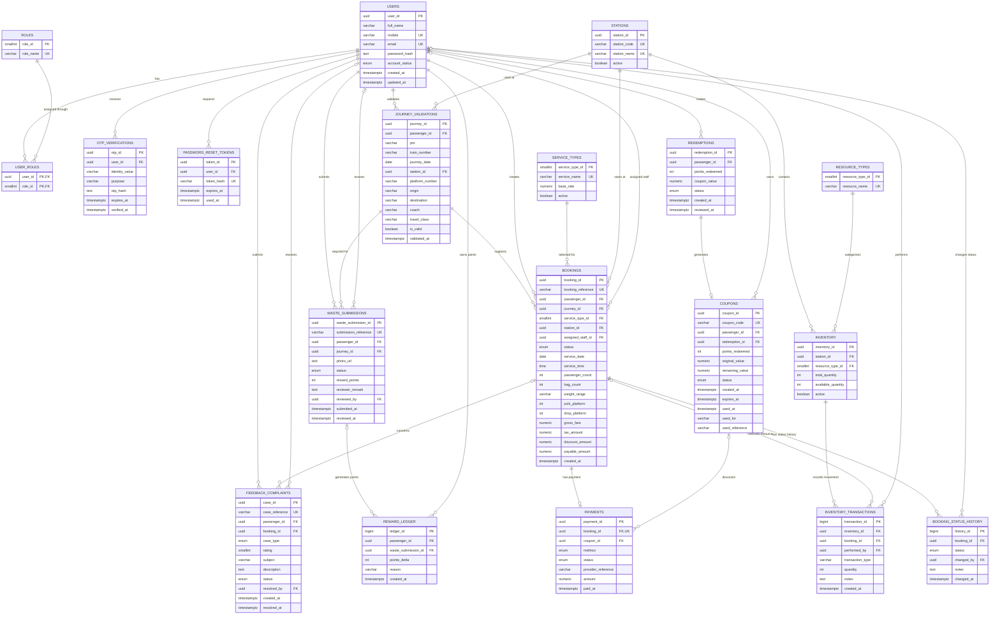

# EcoAccess ER Diagram

This ER diagram shows the entities and their relationships for the complete EcoAccess project in the `FD/dev` branch.

> Open this file in GitHub, VS Code with Mermaid support, or Mermaid Live Editor to render the connected diagram.



## Relationship/cardinality legend

- `||--o{`: one parent record can have zero or many child records.
- `||--o|`: one parent record can have zero or one child record.
- `o|--o{`: an optional parent reference can be associated with zero or many records.
- `PK`: primary key.
- `FK`: foreign key.
- `UK`: unique key.

## Main business flow

```text
Passenger/User
    │
    ├── validates Journey ──> Journey Validation ──> creates Booking
    │                                               │
    │                                               ├── assigned Staff
    │                                               ├── uses Station Inventory
    │                                               ├── receives Status History
    │                                               └── has Payment ──> optional Coupon
    │
    ├── submits Waste ──> Admin Review ──> Reward Ledger ──> Points
    │                                                        │
    │                                                        └── Redemption ──> Coupon
    │
    └── submits Feedback/Complaint ──> Booking and Admin Resolution
```

## LocalStorage-to-database connections

| Current localStorage key | Relational tables | Important connection |
|---|---|---|
| `passengers` | `users`, `user_roles` | `bookings.passenger_id -> users.user_id` |
| `staff` | `users`, `user_roles` | `bookings.assigned_staff_id -> users.user_id` |
| `journeyValidations` | `journey_validations`, `stations` | `bookings.journey_id -> journey_validations.journey_id` |
| `bookings` | `bookings`, `booking_status_history`, `payments` | Booking connects passenger, journey, station, service, and staff |
| `resources` | `resource_types`, `inventory`, `inventory_transactions` | Inventory connects station and resource type |
| `waste` | `waste_submissions`, `reward_ledger` | Approved waste creates reward points |
| `coupons` | `coupons` | Coupon can discount a payment or train fare |
| `redemptions` | `redemptions`, `coupons` | Redemption generates a coupon |
| `complaints` | `feedback_complaints` | Case connects passenger and optional booking |
