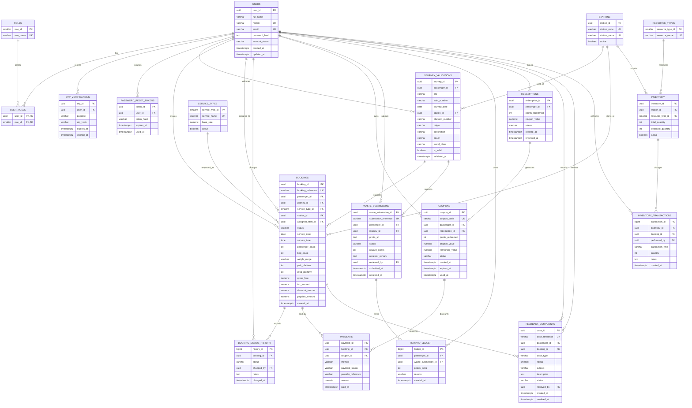

# EcoAccess Database Design

This design covers the complete EcoAccess flow represented in the `FD/dev` branch:

- Passenger, staff, and admin authentication
- Passenger registration, OTP verification, profile, and password reset
- Journey/PNR validation
- Porter, wheelchair, and inter-platform vehicle bookings
- Fare calculation, coupons, and simulated payments
- Staff assignment and service-status tracking
- Waste-disposal photo review and reward points
- Reward coupons and redemptions
- Feedback and complaints
- Station resource availability

The current project is a frontend prototype using `localStorage` as a mock backend. The design below is a production-oriented relational model intended to replace those localStorage collections with a real API and database.

## ER diagram

## Mapping from the current frontend

| Current localStorage collection | Database table(s) |
|---|---|
| `passengers` | `users`, `user_roles`, `reward_ledger` |
| `staff` | `users`, `user_roles` |
| admin demo account | `users`, `user_roles` |
| `journeyValidations` | `journey_validations`, `stations` |
| `bookings` | `bookings`, `booking_status_history`, `payments` |
| `resources.wheelchairs` / `resources.vehicles` | `resource_types`, `inventory`, `inventory_transactions` |
| `waste` | `waste_submissions`, `reward_ledger` |
| `rewards` | `service_types` is unrelated; maintain a future `reward_catalog` if fixed rewards are reintroduced |
| `redemptions` | `redemptions`, `coupons` |
| `coupons` | `coupons` |
| `complaints` | `feedback_complaints` |
| `session` | server-side session or access/refresh-token store; do not persist plaintext session data in the browser |
| `pending` | short-lived registration transaction or `otp_verifications` |

## Important implementation decisions

1. Store only password hashes; the demo passwords in the README must not be inserted into production.
2. Use UUIDs internally and human-readable references such as `BK-...`, `WD-...`, and `CP-...` for UI display.
3. Keep status history rather than overwriting the booking status without an audit trail.
4. Store waste images in object storage and save only the URL/key in `waste_submissions.photo_url`.
5. A reward balance is derived from `reward_ledger`; do not update a passenger points column without a matching ledger entry.
6. Do not store full card number or CVV. The payment table stores only the payment method and provider reference.
7. Enforce the four-hour waste submission cooldown and 24-hour review SLA in the service layer and scheduled jobs, with database indexes supporting those queries.
8. The DDL uses PostgreSQL types and constraints. Adapt UUID generation if the selected database is MySQL or SQL Server.
